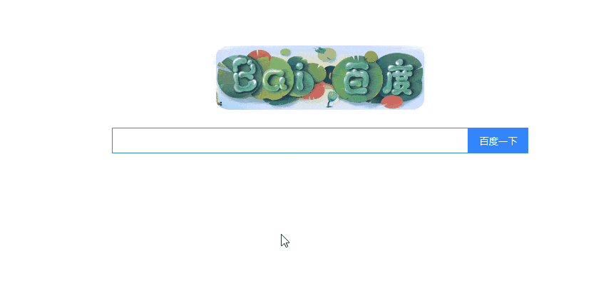

#Servlet+Ajax实现搜索框智能提示功能  
## Abstract  
- 说明：Servlet-Ajax-Demo，使用Servlet和Ajax，实现了一个类似于百度/Google搜索引擎的输入框
- 声明：本文只为我闲暇时候学习所做笔记，仅供我无聊时复习所用，若文中有错，误导了读者，敬请谅解！！！  
- 代码使用：可直接下载或者git clone 导入idea即可运行
- 改进：代码比较粗
- 效果：
<<<<<<< HEAD

=======

>>>>>>> e9d144e189d715ddffbde369dfada44e762881c3
我的学习笔记：
后面在补充  
参考资料：https://www.imooc.com/learn/678  
致谢：感谢慕课网的 资源库老师
